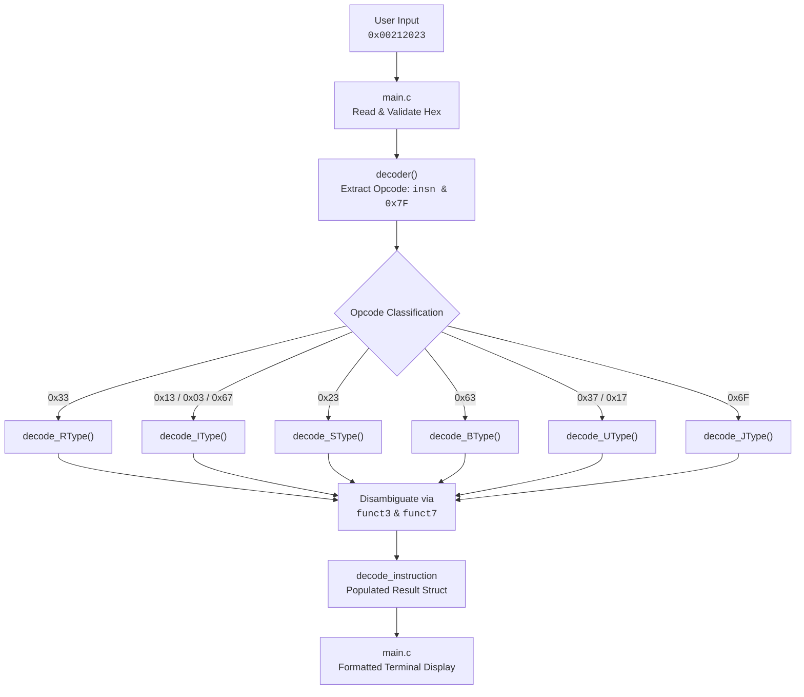

# RISC-V RV32I Instruction Decoder (in C)


A from-scratch RISC-V RV32I instruction decoder written in C. It takes a 32-bit RISC-V machine instruction as hexadecimal input, identifies its instruction format, extracts the encoded fields, reconstructs immediates, and determines the corresponding instruction.

The decoder currently handles the major RV32I instruction formats: **R, I, S, B, U, and J**.

**Decoded fields:** `opcode`, `rd`, `rs1`, `rs2`, `funct3`, `funct7`, `immediate`, and `shamt`.

> **Note:** Not every field is meaningful for every instruction format. The decoder interprets fields according to the corresponding RV32I encoding layout.


---

## Contents

- [Requirements](#requirements)
- [Getting started](#getting-started)
- [How it works](#how-it-works)
- [Architecture / Workflow](#architecture--workflow)
- [Project structure](#project-structure)
- [Relationship to Project 1](#relationship-to-project-1)
- [Example](#example)
- [Challenges I ran into](#challenges-i-ran-into)
- [What I'd add next](#what-id-add-next)
- [License](#license)

---

## Requirements

This project uses `make`, `gcc`, and a Linux-style shell.

- **Linux:** `gcc` and `make` can be installed via your package manager.
- **macOS:** install the Xcode command-line tools (`xcode-select --install`).
- **Windows:** use [WSL](https://learn.microsoft.com/en-us/windows/wsl/install) and run the commands below inside the WSL/Ubuntu terminal, not PowerShell or CMD.

On Ubuntu/WSL:
```bash
sudo apt update
sudo apt install build-essential
```
`build-essential` provides the GCC compiler and Make.

---

## Getting started

### 1. Clone the project
```bash
git clone https://github.com/DharanidharanRavikumar/riscv-decoder.git
cd riscv-decoder
```

### 2. Build the decoder
```bash
make
```

### 3. Run the decoder
```bash
./decoder
```

The program accepts a 32-bit RISC-V machine instruction in hexadecimal:
```text
Instruction > 0x00212023
```
Enter `0` to exit.

---

## How it works

The decoder follows the instruction encoding defined by the official RV32I ISA specification.

The 32-bit instruction is first masked to extract the 7-bit opcode:
```c
result.opcode = inp_inst & 0x7F;
```

The opcode is then used to determine the broad instruction format:

| Opcode | Format | Description |
| :--- | :--- | :--- |
| `0x33` | **R-type** | Register-register operations (`ADD`, `SUB`, `SLL`, `SLT`...) |
| `0x13` | **I-type** | Immediate arithmetic & shifts (`ADDI`, `SLLI`, `SRLI`...) |
| `0x03` | **I-type** | Load operations (`LB`, `LH`, `LW`, `LBU`, `LHU`) |
| `0x67` | **I-type** | Indirect jump (`JALR`) |
| `0x23` | **S-type** | Memory stores (`SB`, `SH`, `SW`) |
| `0x63` | **B-type** | Conditional branches (`BEQ`, `BNE`, `BLT`, `BGE`...) |
| `0x37` | **U-type** | Load Upper Immediate (`LUI`) |
| `0x17` | **U-type** | Add Upper Immediate to PC (`AUIPC`) |
| `0x6F` | **J-type** | Unconditional jump and link (`JAL`) |

The opcode alone does not always identify the exact instruction. For R-type instructions, `funct3` and `funct7` are also needed:

```text
opcode = 0x33 → R-type → funct3 → funct7 → ADD / SUB / SRL / SRA / ...
```

Different formats also arrange their immediate fields differently. A B-type immediate, for example, is reconstructed from several separated bit ranges rather than extracted as one continuous field.

---

## Architecture / Workflow

The decoder follows a hierarchical decoding pipeline: a raw 32-bit instruction enters as hex input, is routed by opcode to a format-specific decoder, and comes back out as one filled-in result struct.



The key design principle: the decoder works in stages, not as one large lookup. Opcode narrows the format, format-specific fields narrow the exact instruction, and each stage is handled by its own function rather than one function trying to handle every case at once.

---

## Project structure

```text
riscv-decoder/
├── main.c           # handles user input and displays the decoded result
├── decoder.c        # decoding logic for each RV32I instruction format
├── decoder.h        # shared struct, type definitions, declarations
├── Makefile         # build script
├── Sample_Inst.txt  # sample machine instructions for testing
├── assets/          # screenshot and visual demos
└── .gitignore
```

`decoder.c` splits decoding into one function per format:
`decode_RType()`, `decode_IType()`, `decode_SType()`, `decode_BType()`, `decode_UType()`, and `decode_JType()`.

---

## Relationship to Project 1

This project builds on my previous [RISC-V RV32I Instruction Simulator](https://github.com/DharanidharanRavikumar/riscv-simulator).

- **Project 1 — Instruction Simulator:** fetches, decodes, and executes RISC-V machine instructions.
- **Project 2 — Instruction Decoder:** focuses specifically on interpreting the 32-bit instruction encoding and reconstructing its fields.

Keeping decoding separate makes the instruction encoding logic easier to inspect, test, and reuse in future architecture projects.

---

## Example

```text
========================================
       RISC-V RV32I INSTRUCTION DECODER
========================================

Enter a 32-bit instruction in hexadecimal.
Example: 0x003100B3
Enter 0 to exit.

Instruction > 0x00212023

----------------------------------------
           DECODED INSTRUCTION
----------------------------------------
Original Raw instruction : 0x00212023
Instruction     : SW
Type            : S
Opcode          : 0x23
rd              : x0
rs1             : x2
rs2             : x2
funct3          : 0x02
funct7          : 0x00
Immediate       : 0
shamt           : 0
----------------------------------------
```

> **Note:** Some displayed fields may not be meaningful for the selected instruction format. For example, S-type instructions do not contain an `rd` field.

---

## Challenges I Ran Into

Writing a bit-level instruction decoder in C requires translating hardware bitfields into software logic. Here are three tricky implementation challenges and bugs I ran into while writing the C code and how I solved them:

### 1. The Unsigned vs. Signed Immediate Trap (Arithmetic Right Shifts in C)
- **The Mistake:** In RISC-V, immediates (such as I-type offsets) are signed two's complement integers. In C, raw machine instructions are stored as unsigned 32-bit integers (`uint32_t`). When I first extracted the 12-bit I-type immediate using `inp_inst >> 20`, C performed a logical (zero-filling) right shift instead of an arithmetic (sign-preserving) shift. As a result, negative offsets (like `-4` in load/branch offsets) displayed as large positive numbers like `4092` instead of negative integers.
- **How I found it:** During testing with negative offsets, the raw immediate printed as a large 12-bit unsigned value rather than a negative signed integer.
- **The Fix:** In C, arithmetic right shifts only happen on signed types. I solved this by explicitly casting to a signed integer before shifting: `(int32_t)inp_inst >> 20`. For S-type and B-type immediates where bitfields are spliced together manually, I used the shift-left then arithmetic-shift-right idiom `(int32_t)(immediate << 19) >> 19` so C reliably sign-extends the top bits.

### 2. Reconstructing Non-Contiguous Immediate Bits (B-Type & J-Type Bit-Splicing)
- **The Mistake:** In RISC-V, branch (B-type) and jump (J-type) target addresses are always multiples of 2 bytes, so bit 0 is omitted from the encoding. Furthermore, RISC-V intentionally scrambles the immediate layout in hardware so that the sign bit always stays fixed at bit 31 across all formats to optimize hardware multiplexers. When writing `decode_BType()`, I initially miscalculated the bit shifts when piecing `imm[12]`, `imm[11]`, `imm[10:5]`, and `imm[4:1]` back together. A branch instruction with an offset of 16 was decoding to garbage because one shift offset was off by one.
- **How I found it:** Stepping through sample branch instructions like `BEQ` (`0x00208863`), the reconstructed branch target offset did not match the expected assembler offset.
- **The Fix:** Instead of trying to combine the scattered bits in a single complicated one-liner, I extracted each piece individually into its own variable (`imm_12`, `imm_11`, `imm_10_5`, `imm_4_1`), verified each position against the RISC-V spec, and then assembled the full immediate before sign-extending.

### 3. Handling Shift Instructions Inside I-Type (The `funct7` Exception)
- **The Mistake:** Standard I-type instructions (like `ADDI` or `LW`) use all 12 bits [31:20] for a signed immediate and do not have a `funct7` field. However, shift instructions (`SLLI`, `SRLI`, and `SRAI`) are special: in RV32I, shifts are at most 31 bits, so only bits [24:20] are used for the shift amount (`shamt`). The remaining upper bits [31:25] are repurposed as a `funct7` discriminant to distinguish logical shifts (`SRLI`, `0x00`) from arithmetic shifts (`SRAI`, `0x20`). My initial I-type decoder treated all `0x13` opcodes uniformly, which caused `SRLI` and `SRAI` to collide and left garbage in the `shamt` field.
- **How I found it:** Testing `0x40315093` (`SRAI`) resulted in the instruction being misidentified or showing the wrong shift value because `funct7` wasn't being inspected.
- **The Fix:** Inside `decode_IType()`, I added dedicated handling for shift operations (`funct3 == 0x1` and `funct3 == 0x5`) that extracts `inp_inst & 0x1F` for `shamt`, and checks `funct7` to differentiate `SRLI` from `SRAI`.

---

## What I'd add next

- Complete RV32I instruction coverage
- Automated instruction-level test cases
- Binary input support (not just hex)
- Validation for illegal or unsupported encodings
- More systematic immediate/sign-extension tests
- Extension toward RV32M and RV64 decoding
- Integration with my [RISC-V instruction simulator](https://github.com/DharanidharanRavikumar/riscv-simulator)

---

## License

This project is licensed under the [MIT License](LICENSE).
