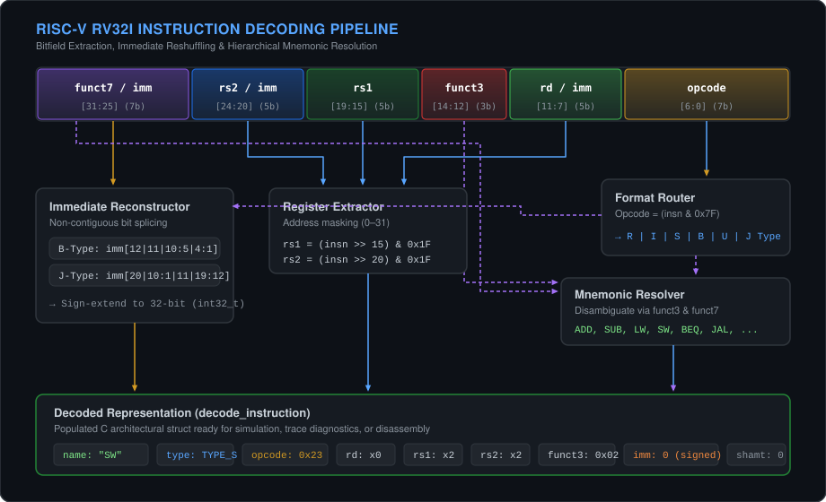

# RISC-V RV32I Instruction Decoder (in C)


A modular, from-scratch 32-bit **RISC-V (RV32I Base Integer Instruction Set)** instruction decoder implemented in C. 

The tool accepts raw 32-bit machine instructions in hexadecimal, identifies the instruction format, extracts architectural bitfields, reconstructs signed immediates, and resolves the exact mnemonic according to the unprivileged RISC-V ISA specification.

Supported formats: **R-type, I-type, S-type, B-type, U-type, and J-type**.


---

## Contents

- [Motivation & Context](#motivation--context)
- [Requirements & Build](#requirements--build)
- [ISA Encoding & Field Extraction](#isa-encoding--field-extraction)
- [Decoding Workflow](#decoding-workflow)
- [Verification & Testing](#verification--testing)
- [Technical Notes & Low-Level Considerations](#technical-notes--low-level-considerations)
- [Project Structure](#project-structure)
- [Future Extensions](#future-extensions)
- [License](#license)

---

## Motivation & Context

This project serves as a standalone component following my [RISC-V RV32I Instruction Simulator](https://github.com/DharanidharanRavikumar/riscv-simulator):

- **Project 1 (Simulator):** Focuses on CPU state transitions, the fetch-decode-execute cycle, and memory execution.
- **Project 2 (Decoder):** Isolates the instruction decoding stage into a dedicated, reusable C module. Decoupling the decoder simplifies unit verification, boundary testing, and potential integration into custom disassemblers or cycle-accurate simulators.

---

## Requirements & Build

### Toolchain Requirements
- Standard C compiler (`gcc` or `clang`) with C11 support.
- `make` utility.
- Linux, macOS, or Windows via WSL.

### Compilation & Execution

```bash
# Clone the repository
git clone https://github.com/DharanidharanRavikumar/riscv-decoder.git
cd riscv-decoder

# Compile with Make
make

# Run interactive decoder
./decoder
```

Enter any 32-bit instruction as a hexadecimal value (e.g., `0x00212023` or `00212023`), or enter `0` to exit.

---

## ISA Encoding & Field Extraction

The decoder extracts fields according to the standard RV32I bit layouts:

| Format | Bits [31:25] | Bits [24:20] | Bits [19:15] | Bits [14:12] | Bits [11:7] | Bits [6:0] |
| :--- | :---: | :---: | :---: | :---: | :---: | :---: |
| **R-type** | `funct7` | `rs2` | `rs1` | `funct3` | `rd` | `opcode` |
| **I-type** | `imm[11:0]` | | `rs1` | `funct3` | `rd` | `opcode` |
| **S-type** | `imm[11:5]` | `rs2` | `rs1` | `funct3` | `imm[4:0]` | `opcode` |
| **B-type** | `imm[12\|10:5]` | `rs2` | `rs1` | `funct3` | `imm[4:1\|11]` | `opcode` |
| **U-type** | `imm[31:12]` | | | | `rd` | `opcode` |
| **J-type** | `imm[20\|10:1\|11\|19:12]` | | | | `rd` | `opcode` |


### Internal Data Representation (`decode_instruction`)

Fields are populated into a shared struct defined in `decoder.h`:

```c
typedef struct {
    uint32_t og_inp_inst;          // Raw 32-bit machine word
    InstructionType type;          // TYPE_R, TYPE_I, TYPE_S, TYPE_B, TYPE_U, TYPE_J
    int32_t immediate;             // Reconstructed two's complement signed immediate
    uint8_t opcode;                // 7-bit primary opcode (bits [6:0])
    uint8_t func3;                 // 3-bit sub-function code (bits [14:12])
    uint8_t func7;                 // 7-bit function code (bits [31:25])
    uint8_t rd;                    // Destination register address (x0–x31)
    uint8_t rs1;                   // Source register 1 address (x0–x31)
    uint8_t rs2;                   // Source register 2 address (x0–x31)
    uint8_t shamt;                 // 5-bit shift amount (for SLLI, SRLI, SRAI)
    const char *instruction_name;  // Resolved mnemonic string (e.g., "ADD", "SW")
} decode_instruction;
```

---

## Decoding Workflow



The decoding pipeline operates hierarchically rather than through flat table searches:

1. **Opcode Masking:** The primary 7-bit opcode (`inp_inst & 0x7F`) routes execution to a format-specific handler (`decode_RType`, `decode_IType`, `decode_SType`, `decode_BType`, `decode_UType`, `decode_JType`).
2. **Field Extraction:** Register specifiers (`rd`, `rs1`, `rs2`) and control codes (`funct3`, `funct7`) are masked and shifted according to the detected format.
3. **Immediate Reconstruction:** Scrambled immediate bitfields are spliced into contiguous values and sign-extended to 32 bits.
4. **Mnemonic Disambiguation:** `funct3` (and `funct7` where required, such as `ADD`/`SUB` and `SRL`/`SRA`) disambiguates the specific instruction.
5. **Safety Default:** Any unmapped opcode safely returns `TYPE_UNKNOWN`.

---

## Verification & Testing

To ensure correctness without external dependencies, the repository includes a curated set of test instructions in `Sample_Inst.txt` covering every supported format:

- **R-Type:** `ADD`, `SUB`, `SLL`, `SLT`, `SLTU`, `XOR`, `SRL`, `SRA`, `OR`, `AND`
- **I-Type Arithmetic & Shifts:** `ADDI`, `SLTI`, `SLTIU`, `XORI`, `ORI`, `ANDI`, `SLLI`, `SRLI`, `SRAI`
- **Loads:** `LB`, `LH`, `LW`, `LBU`, `LHU`
- **Control Flow:** `JAL`, `JALR`, `BEQ`, `BNE`, `BLT`, `BGE`, `BLTU`, `BGEU`
- **Stores & Upper Immediates:** `SB`, `SH`, `SW`, `LUI`, `AUIPC`

Each vector has been cross-verified against the official RISC-V specification and output from the GNU RISC-V toolchain (`riscv64-unknown-elf-objdump`).

### Sample Terminal Execution

Decoding a Store Word instruction (`SW x2, 0(x2)`):

```text
========================================
       RISC-V RV32I INSTRUCTION DECODER
========================================

Enter a 32-bit instruction in hexadecimal.
Example: 0x003100B3
Enter 0 to exit.

Instruction > 0x00212023

----------------------------------------
           DECODED INSTRUCTION
----------------------------------------
Original Raw instruction : 0x00212023
Instruction     : SW
Type            : S
Opcode          : 0x23
rd              : x0
rs1             : x2
rs2             : x2
funct3          : 0x02
funct7          : 0x00
Immediate       : 0
shamt           : 0
----------------------------------------
```

---

## Technical Notes & Low-Level Considerations

Translating hardware bit layouts into software C constructs involves several subtle low-level nuances:

### 1. Two's Complement Sign Extension in C
Machine instructions are handled as unsigned words (`uint32_t`). When extracting a 12-bit signed immediate (e.g., in I-type instructions), a standard right shift (`inp_inst >> 20`) in C performs a **logical shift**, zero-filling the upper bits. To preserve negative offsets across 32 bits, the instruction must be explicitly cast to a signed type (`(int32_t)inp_inst >> 20`) to invoke an **arithmetic shift**. For reconstructed immediates (like S-type and B-type), the bit-shift idiom `(int32_t)(immediate << shift) >> shift` is used to propagate the sign bit reliably.

### 2. Disjoint Immediate Splicing & Alignment
RISC-V intentionally scrambles branch (B-type) and jump (J-type) immediate layouts to keep the sign bit pinned to bit 31 across all formats, minimizing hardware multiplexer fan-out. Because RISC-V instructions are at least 2-byte aligned, bit 0 is omitted from the machine word. In software, each slice must be extracted independently and shifted into its correct position:
- **B-Type:** Assembled from `imm[12]`, `imm[11]`, `imm[10:5]`, and `imm[4:1]`, with bit 0 implicitly set to 0.
- **J-Type:** Assembled from `imm[20]`, `imm[19:12]`, `imm[11]`, and `imm[10:1]`, with bit 0 implicitly set to 0.

### 3. Specialized I-Type Shift Encoding
While typical I-type instructions treat bits [31:20] as a single 12-bit immediate, shift instructions (`SLLI`, `SRLI`, `SRAI`) in RV32I only shift by up to 31 positions. Consequently, only bits [24:20] represent the shift amount (`shamt`). Bits [31:25] are repurposed as a `funct7` discriminant (`0x00` for logical shift vs. `0x20` for arithmetic shift). The decoder handles shifts as a specialized sub-case within `decode_IType()` to extract `shamt` via `inp_inst & 0x1F` while inspecting `funct7`.

---

## Project Structure

```text
riscv-decoder/
├── decoder.h        # Struct definitions, instruction types, function prototypes
├── decoder.c        # Format-specific decoders & bit-manipulation logic
├── main.c           # CLI interactive loop & diagnostic printout
├── Makefile         # GCC build rules (-Wall -Wextra -std=c11)
├── Sample_Inst.txt  # Curated test instruction set
├── assets/          # Terminal demo & vector architecture diagram
└── .gitignore
```

---

## Future Extensions

- Support for the **RV32M** standard extension (hardware integer multiplication and division).
- Disassembly string formatting (e.g., printing canonical assembly strings like `addi sp, sp, -16`).
- Direct batch-file disassembly mode for raw `.bin` or hex dumps.
- Integration as a front-end decode library for the [RISC-V Simulator](https://github.com/DharanidharanRavikumar/riscv-simulator).

---

## License

This project is open-source under the [MIT License](LICENSE).

