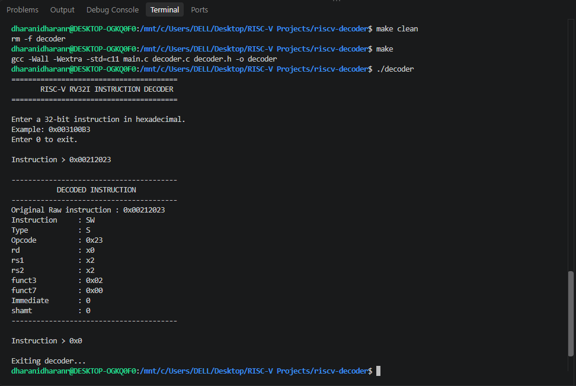

# RISC-V RV32I Instruction Decoder (in C)


A from-scratch RISC-V RV32I instruction decoder written in C. It takes a 32-bit RISC-V machine instruction as hexadecimal input, identifies its instruction format, extracts the encoded fields, reconstructs immediates, and determines the corresponding instruction.

The decoder currently handles the major RV32I instruction formats: **R, I, S, B, U, and J**.

**Decoded fields:** `opcode`, `rd`, `rs1`, `rs2`, `funct3`, `funct7`, `immediate`, and `shamt`.

> **Note:** Not every field is meaningful for every instruction format. The decoder interprets fields according to the corresponding RV32I encoding layout.



---

## Contents

- [Requirements](#requirements)
- [Getting started](#getting-started)
- [How it works](#how-it-works)
- [Architecture / Workflow](#architecture--workflow)
- [Project structure](#project-structure)
- [Relationship to Project 1](#relationship-to-project-1)
- [Example](#example)
- [Challenges I ran into](#challenges-i-ran-into)
- [What I'd add next](#what-id-add-next)
- [License](#license)

---

## Requirements

This project uses `make`, `gcc`, and a Linux-style shell.

- **Linux:** `gcc` and `make` can be installed via your package manager.
- **macOS:** install the Xcode command-line tools (`xcode-select --install`).
- **Windows:** use [WSL](https://learn.microsoft.com/en-us/windows/wsl/install) and run the commands below inside the WSL/Ubuntu terminal, not PowerShell or CMD.

On Ubuntu/WSL:
```bash
sudo apt update
sudo apt install build-essential
```
`build-essential` provides the GCC compiler and Make.

---

## Getting started

### 1. Clone the project
```bash
git clone https://github.com/DharanidharanRavikumar/riscv-decoder.git
cd riscv-decoder
```

### 2. Build the decoder
```bash
make
```

### 3. Run the decoder
```bash
./decoder
```

The program accepts a 32-bit RISC-V machine instruction in hexadecimal:
```text
Instruction > 0x00212023
```
Enter `0` to exit.

---

## How it works

The decoder follows the instruction encoding defined by the official RV32I ISA specification.

The 32-bit instruction is first masked to extract the 7-bit opcode:
```c
result.opcode = inp_inst & 0x7F;
```

The opcode is then used to determine the broad instruction format:

| Opcode | Format | Description |
| :--- | :--- | :--- |
| `0x33` | **R-type** | Register-register operations (`ADD`, `SUB`, `SLL`, `SLT`...) |
| `0x13` | **I-type** | Immediate arithmetic & shifts (`ADDI`, `SLLI`, `SRLI`...) |
| `0x03` | **I-type** | Load operations (`LB`, `LH`, `LW`, `LBU`, `LHU`) |
| `0x67` | **I-type** | Indirect jump (`JALR`) |
| `0x23` | **S-type** | Memory stores (`SB`, `SH`, `SW`) |
| `0x63` | **B-type** | Conditional branches (`BEQ`, `BNE`, `BLT`, `BGE`...) |
| `0x37` | **U-type** | Load Upper Immediate (`LUI`) |
| `0x17` | **U-type** | Add Upper Immediate to PC (`AUIPC`) |
| `0x6F` | **J-type** | Unconditional jump and link (`JAL`) |

The opcode alone does not always identify the exact instruction. For R-type instructions, `funct3` and `funct7` are also needed:

```text
opcode = 0x33 → R-type → funct3 → funct7 → ADD / SUB / SRL / SRA / ...
```

Different formats also arrange their immediate fields differently. A B-type immediate, for example, is reconstructed from several separated bit ranges rather than extracted as one continuous field.

---

## Architecture / Workflow

The decoder follows a hierarchical decoding pipeline: a raw 32-bit instruction enters as hex input, is routed by opcode to a format-specific decoder, and comes back out as one filled-in result struct.

```text
┌───────────────────────┐
│      USER INPUT       │
│  32-bit instruction,  │
│    entered as hex     │
│    e.g. 0x00212023    │
└───────────┬───────────┘
            │
            ▼
┌───────────────────────┐
│        main.c         │
│    read + validate    │
│ input, call decoder() │
└───────────┬───────────┘
            │ uint32_t instruction
            ▼
┌───────────────────────┐
│       decoder()       │
│ opcode = insn & 0x7F  │
└───────────┬───────────┘
            │
            ▼
┌───────────────────────┐
│ OPCODE CLASSIFICATION │
│ → instruction format  │
└───────────┬───────────┘
            │
   ┌────────┴────────┬───────────────┐
   ▼                 ▼               ▼
┌───────────┐  ┌───────────┐  ┌───────────┐
│   0x33    │  │0x13 / 0x03│  │   0x23    │
│  R-type   │  │  I-type   │  │  S-type   │
└─────┬─────┘  └─────┬─────┘  └─────┬─────┘
      ▼              ▼               ▼
decode_RType() decode_IType() decode_SType()
      │              │               │
   └──┴──────────────┼───────────────┘
                     │
 (0x63 B-type, 0x37/0x17 U-type, 0x6F J-type
  route the same way, each to its own decoder)
                     │
                     ▼
┌───────────────────────┐
│    funct3 / funct7    │
│   disambiguate the    │
│   exact instruction   │
│  (ADD / SUB / ADDI /  │
│   LW / SW / BEQ / …)  │
└───────────┬───────────┘
            │
            ▼
┌───────────────────────┐
│  decode_instruction   │
│        result         │
│  name, type, opcode,  │
│ rd/rs1/rs2, funct3/7, │
│   immediate, shamt    │
└───────────┬───────────┘
            │ return result
            ▼
┌───────────────────────┐
│        main.c         │
│        DISPLAY        │
└───────────────────────┘
```

The key design principle: the decoder works in stages, not as one large lookup. Opcode narrows the format, format-specific fields narrow the exact instruction, and each stage is handled by its own function rather than one function trying to handle every case at once.

---

## Project structure

```text
riscv-decoder/
├── main.c           # handles user input and displays the decoded result
├── decoder.c        # decoding logic for each RV32I instruction format
├── decoder.h        # shared struct, type definitions, declarations
├── Makefile         # build script
├── Sample_Inst.txt  # sample machine instructions for testing
├── assets/          # screenshot and visual demos
└── .gitignore
```

`decoder.c` splits decoding into one function per format:
`decode_RType()`, `decode_IType()`, `decode_SType()`, `decode_BType()`, `decode_UType()`, and `decode_JType()`.

---

## Relationship to Project 1

This project builds on my previous [RISC-V RV32I Instruction Simulator](https://github.com/DharanidharanRavikumar/riscv-simulator).

- **Project 1 — Instruction Simulator:** fetches, decodes, and executes RISC-V machine instructions.
- **Project 2 — Instruction Decoder:** focuses specifically on interpreting the 32-bit instruction encoding and reconstructing its fields.

Keeping decoding separate makes the instruction encoding logic easier to inspect, test, and reuse in future architecture projects.

---

## Example

```text
========================================
       RISC-V RV32I INSTRUCTION DECODER
========================================

Enter a 32-bit instruction in hexadecimal.
Example: 0x003100B3
Enter 0 to exit.

Instruction > 0x00212023

----------------------------------------
           DECODED INSTRUCTION
----------------------------------------
Original Raw instruction : 0x00212023
Instruction     : SW
Type            : S
Opcode          : 0x23
rd              : x0
rs1             : x2
rs2             : x2
funct3          : 0x02
funct7          : 0x00
Immediate       : 0
shamt           : 0
----------------------------------------
```

> **Note:** Some displayed fields may not be meaningful for the selected instruction format. For example, S-type instructions do not contain an `rd` field.

---

## Challenges I ran into

Building the decoder was useful because several problems forced me to understand the instruction encoding rather than simply translating the encoding table into C code:

### 1. The same 32 bits mean different things for different formats
- **The Mistake:** At first, I approached every instruction as if fields like `rd`, `rs1`, `rs2`, `funct3`, `funct7`, and `immediate` were common to all of them. This broke down when implementing S-, B-, U-, and J-type instructions. S-type has no `rd` field, while U-type uses a 20-bit immediate instead.
- **How I found it:** While writing the format-specific decoder functions, I kept hitting fields that were meaningless for certain formats. Comparing the actual RV32I encoding layouts with my structure made the problem obvious.
- **The Fix:** I separated decoding into one function per format. The main decoder first determines the broad format from the opcode, then calls the matching function. This changed my understanding of decoding from *"extract all fields"* to *"interpret the 32 bits according to its format."*

### 2. Reconstructing a split immediate
- **The Mistake:** I expected an immediate to always sit in one continuous range of bits, like the I-type immediate does. That assumption failed on B-type instructions, where the immediate is scattered:
  - `imm[12]` → bit 31
  - `imm[10:5]` → bits 30:25
  - `imm[4:1]` → bits 11:8
  - `imm[11]` → bit 7
- **How I found it:** During B-type testing, the decoder produced an incorrect immediate. Tracing the extraction code back against the encoding table showed the immediate had to be reconstructed from several separate bit ranges, not read as one piece.
- **The Fix:** I extracted each part independently, then combined them into the final immediate before sign-extending.

### 3. Opcode alone isn't enough to identify an instruction
- **The Mistake:** I initially treated the opcode as if it directly named the instruction, assuming `0x33` meant `ADD`. It doesn't; several R-type instructions share that same opcode.
- **How I found it:** While implementing the R-type decoder, I found `ADD`, `SUB`, `SRL`, and `SRA` couldn't be told apart by opcode alone:
  - `funct3 = 0x0`, `funct7 = 0x00` → `ADD`
  - `funct3 = 0x0`, `funct7 = 0x20` → `SUB`
  - `funct3 = 0x5`, `funct7 = 0x00` → `SRL`
  - `funct3 = 0x5`, `funct7 = 0x20` → `SRA`
  
  The same pattern showed up again with I-type shifts (`SRLI` vs `SRAI`).
- **The Fix:** I structured the decoder as a hierarchical decision:
  ```text
  opcode → format → funct3 → funct7 (when needed) → exact instruction
  ```
  This makes the decoder's structure mirror the actual structure of the RISC-V ISA, rather than treating identification as a single lookup.

---

## What I'd add next

- Complete RV32I instruction coverage
- Automated instruction-level test cases
- Binary input support (not just hex)
- Validation for illegal or unsupported encodings
- More systematic immediate/sign-extension tests
- Extension toward RV32M and RV64 decoding
- Integration with my [RISC-V instruction simulator](https://github.com/DharanidharanRavikumar/riscv-simulator)

---

## License

This project is licensed under the [MIT License](LICENSE).
